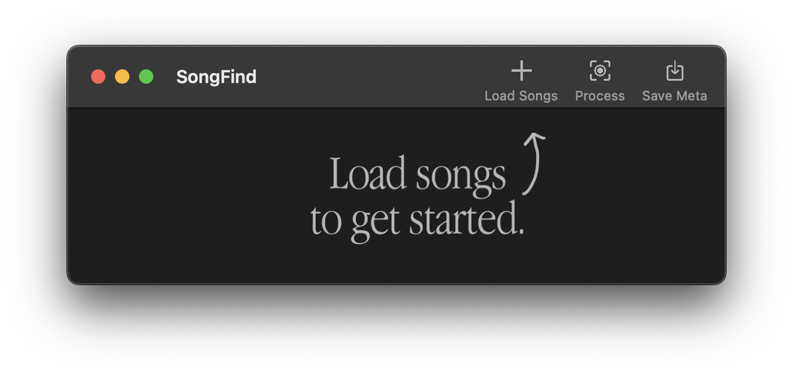

# SongFind

A cross-platform music identification application for power users. Super accurate through the Shazam API, and does everything you would ever want - and more!

## Features
- Batch music identification with directory selection
- Extensive music information including album art, artist, album, release date, genre, and much, much more
- **Automatic metadata tagging and album art addition for music files**
- Simple, yet powerful interface
- Cross-platform and native feel through the WxWidgets library (WxPython)
- Music identification through the Shazam API
- Object oriented design for easy extensibility